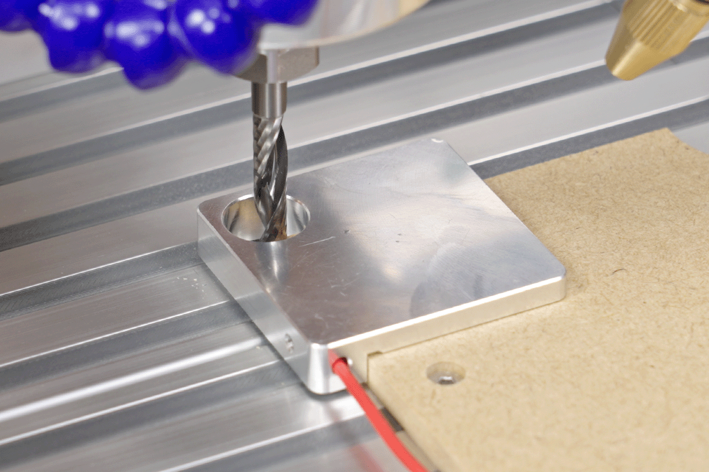

# GRBL XYZ Corner Probe Macro

This is a GRBL-compatible XYZ corner probing macro for setting the work coordinate origin using a conductive XYZ touch probe block.

The macro probes Z first, then probes X and Y from the selected corner direction.  
It sets the current work coordinate system so that the workpiece corner becomes `X0 Y0`, and the material top surface becomes `Z0`.

The probing logic uses standard GRBL-compatible commands such as `G38.2` and `G10 L20`.

This macro is not specific to any single sender software. It may be used with different GRBL control software such as gSender, CNCjs, or other GRBL senders, depending on how the software handles macros, variables, and expression syntax.

## Macro file

The macro itself is available here:

[`xyz-corner-probe.nc`](./xyz-corner-probe.nc)

## What this macro does

- Starts from the corner hole of an XYZ touch probe block
- Probes the Z surface of the probe block
- Sets the material top surface as `Z0`
- Probes the selected X side
- Sets the X coordinate based on the tool radius and probe block thickness
- Probes the selected Y side
- Sets the Y coordinate based on the tool radius and probe block thickness
- Moves to the resulting `X0 Y0` position

## Tested setup

This macro was created and tested on a GRBL-based desktop CNC setup.

Example setup:

- Machine: LUNYEE 3020 Nova
- Controller: GRBL-based controller
- Firmware: GRBL-compatible 1.1f
- Probe type: Conductive XYZ touch probe block
- Tool: Conductive end mill
- Probe input: Triggered when the tool touches the probe block

## Example XYZ touch probe block

This setup uses a conductive XYZ touch probe block.

Example product link:

- XYZ Touch Probe Block: https://s.click.aliexpress.com/e/_c4OqYFct

This is an affiliate link, used to allow AliExpress to redirect visitors to the most appropriate regional domain based on their location.

Please note that similar-looking probe blocks may have different dimensions. Always measure your own probe block and confirm that the probe input is working correctly before running the macro.

## Probe connection example for LUNYEE 3020 Nova

This is the basic connection example for a conductive XYZ touch probe block.

For this type of probe block, the probe input is triggered when the tool and the probe block make electrical contact.

```text
XYZ Touch Probe Block              3020 Nova

Probe block body  ---------------> PROBE S
Tool / end mill clip ------------> PROBE -
```

In this setup:

- The probe block body is connected to `PROBE S`
- The tool or end mill is connected to `PROBE -` using an alligator clip
- When the tool touches the probe block, `PROBE S` is connected to `PROBE -`, triggering the probe input

In some setups, connecting `PROBE -` to a conductive grounded part of the machine chassis may also work, but only if the tool is electrically connected to that ground path.

For reliability, directly clipping to the tool or end mill is recommended.

Before running the macro, test the probe input in your sender software and make sure it changes state when the tool touches the probe block.

## Compatibility note

The probing commands used in this macro are standard GRBL-compatible G-code commands.

However, the variable and expression syntax, such as:

```gcode
%endmillDiameter = 6.35
G0 Z[safeZ]
G38.2 X[xyProbeTravel * sx] F[fast]
```

depends on the macro parser of the sender software.

If your sender does not support this syntax, you may need to rewrite the macro using that software's own macro format, or manually replace the variables with fixed numeric values.

## Corner direction setting

This macro can be adapted for different workpiece corners by changing only `sx` and `sy`.

Default setting:

```gcode
%sx = 1
%sy = -1
```

This default setting is for the left-back corner.

| Corner | `sx` | `sy` |
|---|---:|---:|
| Left Front | `1` | `1` |
| Left Back | `1` | `-1` |
| Right Front | `-1` | `1` |
| Right Back | `-1` | `-1` |

In this macro:

- `sx` controls the X probing direction and X coordinate sign
- `sy` controls the Y probing direction and Y coordinate sign

These values are based on the actual X+ and Y+ movement directions of your machine.  
They do not depend on the homing position itself.

Before running the macro, jog your machine manually and confirm which direction X+ and Y+ actually move.  
If your machine has different axis directions, verify and adjust the probing direction before running the macro.

## Coordinate direction overview

```text
Top view

                  Y+
                  ^
                  |
                  |

        +-------------------+
        |                   |
        |       Stock       |
        |                   |
        +-------------------+

X- <---------------------------------> X+
```

Example for the default left-back setting:

```gcode
%sx = 1
%sy = -1
```

This means:

- X side is probed in the X+ direction
- Y side is probed in the Y- direction

## Important starting position



Before running the macro:

1. Place the end mill in the center of the probe block corner hole
2. Make sure the tool tip is below the top surface of the probe block
3. Make sure the spindle is OFF
4. Confirm that the probe input is working correctly
5. Confirm that the selected `sx` and `sy` values match the corner you are probing

The macro assumes that the tool starts inside the probe block corner hole.

## Example video

This macro is used in the following YouTube video:

- https://youtu.be/f7GCkKY4fKs?t=47

## Parameters

Edit these values in `xyz-corner-probe.nc` to match your tool, probe block, and setup:

```gcode
%endmillDiameter = 6.35
%toolR = endmillDiameter / 2

%probeBlockZ = 5.04
%probeBlockX = 10.03
%probeBlockY = 10.00

%fast = 70.0
%slow = 30.0

%sx = 1
%sy = -1

%safeZ = 13.0

%zProbeTravel = 30.0
%zBackoff = 2.0
%zReprobeTravel = 5.0
%zLiftAfterProbe = 3.0

%zTouchDistanceX = 10.0
%zTouchDistanceY = 10.0

%xyApproach = 20.0
%xyProbeTravel = 45.0
%xyDepthBelowPlateTop = 3.0
%xyBackoff = 2.0
%xyReprobeTravel = 8.0
%xyOutClear = 10.0
%xyInsetFromEdge = 5.0
```

## Parameter explanation

| Parameter | Description |
|---|---|
| `endmillDiameter` | Diameter of the end mill used for probing |
| `toolR` | Tool radius, calculated from `endmillDiameter` |
| `probeBlockZ` | Height / thickness of the probe block for Z probing |
| `probeBlockX` | X-side thickness of the probe block |
| `probeBlockY` | Y-side thickness of the probe block |
| `fast` | First probing feed rate |
| `slow` | Second, slower probing feed rate |
| `sx` | X direction setting for the selected corner |
| `sy` | Y direction setting for the selected corner |
| `safeZ` | Z lift distance used to move the tool out of the corner hole |
| `zProbeTravel` | Maximum Z probing travel |
| `zBackoff` | Retract distance after the first Z probe |
| `zReprobeTravel` | Maximum travel for the second Z probe |
| `zLiftAfterProbe` | Z lift amount after setting Z |
| `zTouchDistanceX` | X distance from the corner hole to the Z probing point |
| `zTouchDistanceY` | Y distance from the corner hole to the Z probing point |
| `xyApproach` | Extra distance used to move outside the X/Y probing side |
| `xyProbeTravel` | Maximum XY probing travel |
| `xyDepthBelowPlateTop` | How far below the probe block top surface to probe X/Y |
| `xyBackoff` | Retract distance after the first X/Y probe |
| `xyReprobeTravel` | Maximum travel for the second X/Y probe |
| `xyOutClear` | Clearance distance away from the contacted side |
| `xyInsetFromEdge` | Inset distance from the detected X edge before probing Y |

## How the Z probing works

The macro first lifts the tool out of the corner hole:

```gcode
G0 Z[safeZ]
```

Then it moves to the Z probing position:

```gcode
G0 X[zTouchDistanceX * sx] Y[zTouchDistanceY * sy]
```

It probes Z twice:

```gcode
G38.2 Z[-zProbeTravel] F[fast]
G0 Z[zBackoff]
G38.2 Z[-zReprobeTravel] F[slow]
```

Then it sets the current Z position to the probe block height:

```gcode
G10 L20 P0 Z[probeBlockZ]
```

This makes the material top surface become `Z0`.

## How the X probing works

After Z probing, the macro moves outside the selected X side:

```gcode
G0 X[-(zTouchDistanceX + xyApproach) * sx]
```

Then it lowers to the XY probing height:

```gcode
G0 Z[-(zLiftAfterProbe + xyDepthBelowPlateTop)]
```

It probes X twice:

```gcode
G38.2 X[xyProbeTravel * sx] F[fast]
G0 X[-xyBackoff * sx]
G38.2 X[xyReprobeTravel * sx] F[slow]
```

Then it sets the X coordinate:

```gcode
G10 L20 P0 X[-(toolR + probeBlockX) * sx]
```

This compensates for:

- Tool radius
- Probe block X thickness
- Selected X side direction

## How the Y probing works

Before probing Y, the macro moves outside the selected Y side:

```gcode
G0 Y[-(zTouchDistanceY + xyApproach) * sy]
```

Then it moves slightly inside from the detected X edge:

```gcode
G90
G0 X[xyInsetFromEdge * sx]
G91
```

It probes Y twice:

```gcode
G38.2 Y[xyProbeTravel * sy] F[fast]
G0 Y[-xyBackoff * sy]
G38.2 Y[xyReprobeTravel * sy] F[slow]
```

Then it sets the Y coordinate:

```gcode
G10 L20 P0 Y[-(toolR + probeBlockY) * sy]
```

This compensates for:

- Tool radius
- Probe block Y thickness
- Selected Y side direction

## Work coordinate setting

This macro uses:

```gcode
G10 L20 P0
```

This sets the current work coordinate system.

If you always use G54 and want to set G54 explicitly, you can change:

```gcode
G10 L20 P0
```

to:

```gcode
G10 L20 P1
```

For example:

```gcode
G10 L20 P1 Z[probeBlockZ]
G10 L20 P1 X[-(toolR + probeBlockX) * sx]
G10 L20 P1 Y[-(toolR + probeBlockY) * sy]
```

## Safety notes

Use this macro at your own risk.

Before running it on a real workpiece:

- Test the probe input first
- Confirm the probe wiring
- Confirm the actual X+ and Y+ movement directions of your machine
- Confirm the probing direction
- Confirm that the selected `sx` and `sy` values match the corner you are probing
- Confirm that the tool starts inside the probe block corner hole
- Make sure the spindle is OFF
- Make sure the tool is conductive and can trigger the probe input
- Confirm that the probe block dimensions are correct
- Run the macro slowly during the first test
- Be ready to stop the machine

Incorrect probe dimensions, wrong corner direction settings, incorrect axis direction assumptions, or incorrect starting position may cause a crash or incorrect work coordinate setting.

This macro was created and tested on a GRBL-based desktop CNC setup, but machine behavior may vary depending on the controller, firmware, sender software, macro parser, and probe input settings.

## Author

Created and tested by [cinetronix](https://www.youtube.com/@cinetronix_labs)

## License

This project is released under the MIT License.

Use this macro and probe block information at your own risk.

See the [LICENSE](./LICENSE) file for details.
